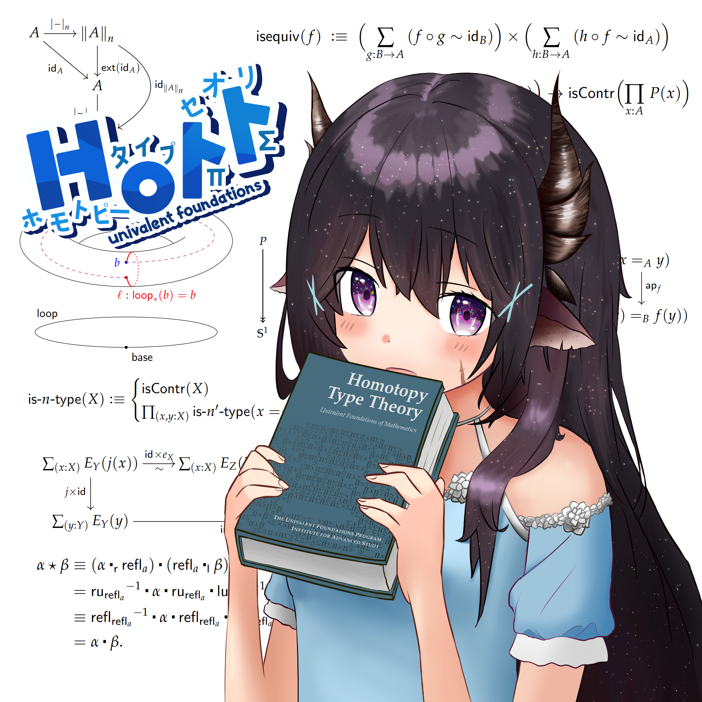

# My Book Collection

Some redraws of a picture I had of Patchy holding LYAH.
(I believe the original image is by Fujishiro Emyu.)

## Learn You a Haskell

## The Rising Sea

## Categories for the Working Mathematician

## Homotopy Type Theory: Univalent Foundations of Mathematics

## Hatcher Algebraic Topology

## Structures and Interpretations of Computer Programs

# Kawaii Logos
See [here](https://github.com/DesyncTheThird/KawaiiLogos) for more logos and details.

## HoTT uwu

## Agda uwu

# OLED Art
See [here](https://github.com/DesyncTheThird/OLED-art) for more details.

  

# Misc

## Agda/Haskell Logos

## Goonlang logo

By popular and repeated requests by friends:

please never ask me to draw this again.
